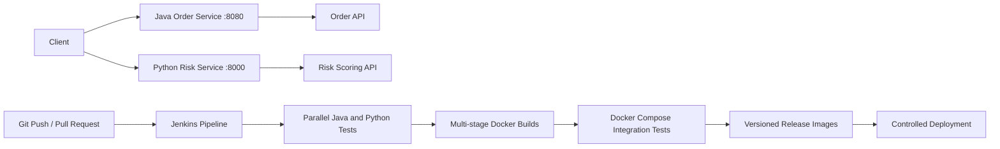

# Automated Multi-Service CI/CD Pipeline

A portfolio project demonstrating an end-to-end CI/CD workflow for a Java Spring Boot service and a Python FastAPI service. Jenkins builds and tests both applications in parallel across multiple runtime versions, creates versioned Docker images, validates the complete system with Docker Compose, and controls deployment of tagged releases.

## Architecture



## What the applications do

### Java order service
- Creates and retrieves customer orders through REST endpoints.
- Validates incoming requests.
- Exposes Spring Boot Actuator health checks.
- Uses Maven, JUnit, MockMvc, and JaCoCo.

### Python risk service
- Calculates a deterministic transaction risk score.
- Classifies requests as low, medium, or high risk.
- Exposes health and risk-assessment REST endpoints.
- Uses FastAPI, Pydantic, pytest, Ruff, mypy, and coverage enforcement.

## CI/CD workflow

1. Checkout source code.
2. Run Java tests on Java 17 and Java 21.
3. Run Python tests on Python 3.11 and Python 3.12.
4. Perform linting, formatting, static typing, and coverage checks.
5. Package the Java application with Maven.
6. Build both applications with multi-stage Dockerfiles.
7. Launch the complete environment with Docker Compose.
8. Execute health-check and API integration tests.
9. Create versioned images using the Jenkins build number.
10. Require manual approval before a tagged deployment.

## Run locally

```bash
# Build and start both services
docker compose up --build -d --wait

# Run integration validation
./scripts/integration-test.sh

# Stop the environment
docker compose down -v
```

### Example requests

```bash
curl -X POST http://localhost:8080/api/orders \
  -H "Content-Type: application/json" \
  -d '{"customerId":"C-100","product":"Laptop","amount":999.99}'

curl -X POST http://localhost:8000/api/risk \
  -H "Content-Type: application/json" \
  -d '{"customer_id":"C-100","amount":999.99,"international":false,"prior_chargebacks":0}'
```

## Repository structure

```text
.
├── Jenkinsfile
├── docker-compose.yml
├── java-order-service/
│   ├── Dockerfile
│   ├── pom.xml
│   └── src/
├── python-risk-service/
│   ├── Dockerfile
│   ├── app/
│   ├── tests/
│   └── requirements-dev.txt
├── scripts/integration-test.sh
└── .github/workflows/ci.yml
```

## Skills demonstrated

Jenkins declarative pipelines, parallel stages, Maven, Spring Boot, Java, FastAPI, Python, automated unit and API testing, JaCoCo and pytest coverage, Ruff, mypy, multi-stage Docker builds, Docker Compose, health checks, semantic release tags, build-number image versioning, integration testing, and approval-based deployment controls.
